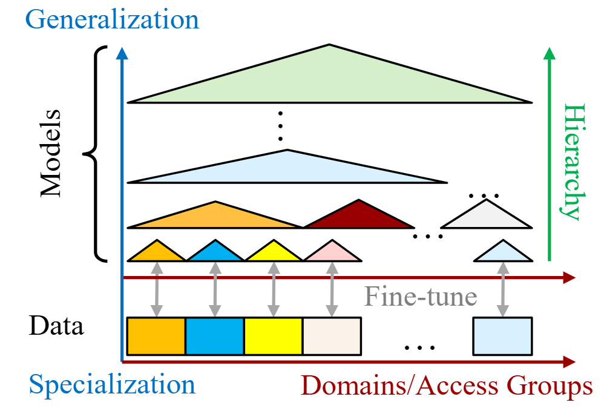
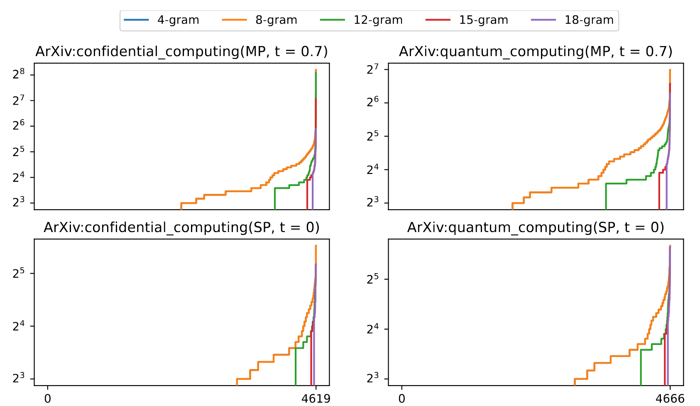
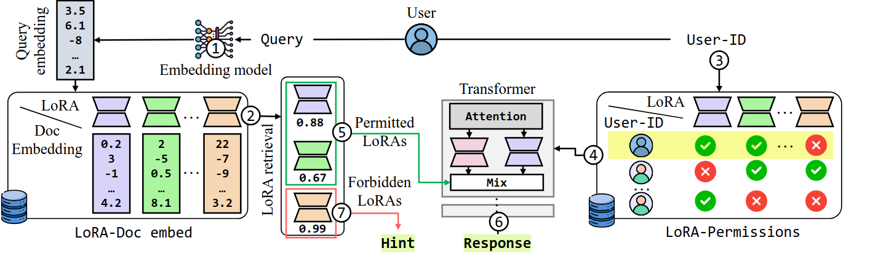

[](https://openreview.net/pdf?id=bV5is3iodg)
[](https://creativecommons.org/publicdomain/zero/1.0/deed.en)
[](https://github.com/huawei-csl/AC-LoRA/stargazers)
[](https://huggingface.co/huawei-csl)

<!-- <h2>🎉 AC-LORA is accepted as poster in NeurIPS 2025<h2> -->

<table border="0" cellspacing="0" cellpadding="0">
  <tr>
    <td></td>
    <td style="vertical-align: middle;">
    <h1>AC-LORA: (Almost) Training-Free Access Control-Aware Multi-Modal LLMs</h1>
    🎉 AC-LORA is accepted as poster in NeurIPS 2025 <br>
    </td>
  </tr>
</table>

---
> ⚡️ **A secure, fast, LoRA merging technique** delivering **state-of-the-art performance** for Large Language Models **without requiring any training or expensive routing gates.**

> 🛡️ **Security by design** With **AC-LoRA**, prevents model leakage from memorization by **avoiding a single monolithic model**, and **distributes the sensitive knowledge into separate LoRAs**.

> 📜🖼️ AC-LoRA works with **multi-modal models**, and not limited to text.

---

## 🚀 Welcome to the **official AC-LoRA repository**!


**AC-LoRA** (Access Control-Low Rank Adaptation) is a **novel, secure and training-free** method to enforce strong access control policy on LLMs by fine-tuning different LoRAs on non-overlapping sensitive dataset, while keeping the base LLMs trained only with the publicly accessible data. Based on the user query and user permission, a set of correct LoRAs are retrieved and output of those LoRAs are merged based on the `cosine` similarity of the user query and user-permitted LoRA fine-tune datasets.

---
## 🧠 How does AC-LORA work?

<details>
<summary>Click to expand a quick explanation of AC-LORA core idea</summary>

#### 1️⃣ Main motivation: Corporate LLMs

<p align="left">
  
</p>

<br>
Besides documentation and code bases, corporate LLMs are trained with employee-specific data such as meeting records, emails/chat records on project progress, wiki entries, etc. The information access typically follows the organization hierarchy.
Users should only be able to access their data and the projects they participate in or manage.
Naively, organizations can train separate models with non-overlapping sensitive documents.
Maintaining these models is *prohibitively expensive*, as an organization with $n$ permission zones has $2^n$ distinct permission groups.

<br>

#### 2️⃣ Major threat: Memorization of LLMs

<p align="left">
  
</p>
Existing AI foundation models are typically trained on all training data.
Making them available to users who are sending queries.
To ensure model safety, i.e., preventing the leakage of sensitive and dangerous information to the user, AI models typically employ censorship methods to monitor input queries or output responses and determine if the response is appropriate.
However, numerous works\cite{} demonstrate that existing censorship mechanisms are inadequate and can be circumvented by attackers.
Typically, the attacker targets the memorization aspect of the AI model.
The models retain a significant portion of the training data and output it in response to a particular set of input queries.
We evaluate the memorization of open-source AI models such as Llama-3.

<br>
<br>


#### 3️⃣ Isolated Fine tuning and similarity based merging

<p align="center">
  
</p>

Separate LoRAs are fine-tuned with non-overlapping sensitive data.
Based on the user's credential, only the permitted LoRAs are retried from.
At the same time, the similarity score (`cosine`) with the embedding of the documents of the permitted retrieved LoRAs are calculated.
Based on the similarity scores, the output of the permitted LoRAs are merged to get the optimal answer that takes account of the knowledge from all the LoRAs, relevant for the user query.
At the same time, the most relevant LoRA many not be retrieved due to the user not having permission.
In that case, AC-LoRA provides a hint to the user that the most relevant information may not be accessible.

</details>

## ⚡How to run AC-LORA

### Requirements

We ran our experiments on two GPUs with 48GB VRAM each. A different setup might require some changes.

### Setup

You can set up the environment with conda like this:

```
conda env create -f environment.yml
conda activate aclora
```

To grade the evaluation of the RepLiQA dataset we use a judge model to grade the answers. We use [ollama](https://ollama.com/) to do it. If you want to use our script ensure that it is installed.

Ensure that all data is located on the correct path specified in the corresponding config file before proceeding to the next section. See [data/info.md](data/info.md)

⚠️ Important: Replace PATH_TO_MODEL with the correct base model path. Then, either place the LoRA files in data/{FLAN|RepLiQA|WikiArts}/LoRAs/ or update the configuration to point to their actual location.

### Major Experiments

All major results from the paper can be found under `results/`

All experiments can be run with or without the `--load_loras` flag.
Without the flag, AC-LoRA will then load LoRAs on demand. This will decrease memory consumption but
increase inference time.

#### RepLiQA

##### Retrival Experiments
To reproduce the data for all the retrival plots from the paper:

```
python src/main.py --config config/RepLiQA/repliqa_retrieval.yaml --load_loras
```

##### Inference Experiments
```
python src/main.py --config config/RepLiQA/repliqa_inference.yaml --load_loras
```

Once the experiments are done you can grade them in the following way:
```
python src/main.py --config config/RepLiQA/config_grade_repliqa.yaml
```

Note: We run grading with [ollama](https://ollama.com/). Ensure it is installed if you are using this script.
Please make sure that all the paths in the config file are set up correctly.

#### FlanV2

Ensure that all data is setup as described [here](data/info.md).
Once it is setup you can run AC-LoRA on Flanv2 either with inference or just retrieval like this:

##### Retrieval
```
python src/main.py --config config/Flan/flan_inference.yaml --load_loras
```
##### Inference
```
python src/main.py --config config/Flan/flan_retrieval.yaml --load_loras
```

#### WikiArts
You can generate some images using AC-LoRA with

   ```
   python src/main.py --config config/WikiArts/wikiarts_examples.yaml --load_loras
   ```
   The example prompts used here are in `data/WikiArts/test/examples.json`

### Plots

The plots from the paper and the corresponding code to generate them are in `results/figs` and `results/plots/`.

### Other infos (Finetuning)

You should be able to use any set of LoRAs you want to as long as base model and model used to finetune correspond.

If you though want to finetune your own LoRAs we provide some code under `src/finetuner.py` we used to do so
for both text and text-image to text models.

To finetune the stable diffusion LoRAs we used the [diffusers](https://github.com/huggingface/diffusers)
library and followed the tutorial under `examples/text-to-image/` in the repo to finetune all our stable diffusion
LoRAs.


## 📚 How to Cite This Work

If you find **AC-LORA** useful in your research or applications, please cite our <a href="https://openreview.net/pdf?id=bV5is3iodg" target="_blank"><strong>paper</strong></a>:

```bibtex
@inproceedings{lazier2025aclora,
    title={{AC}-Lo{RA}: (Almost) Training-Free Access Control Aware Multi-Modal {LLM}s},
    author={Lara Magdalena Lazier and Aritra Dhar and Vasilije Stambolic and Lukas Cavigelli},
    booktitle={The Thirty-ninth Annual Conference on Neural Information Processing Systems},
    year={2025},
    url={https://openreview.net/forum?id=bV5is3iodg}
}
```